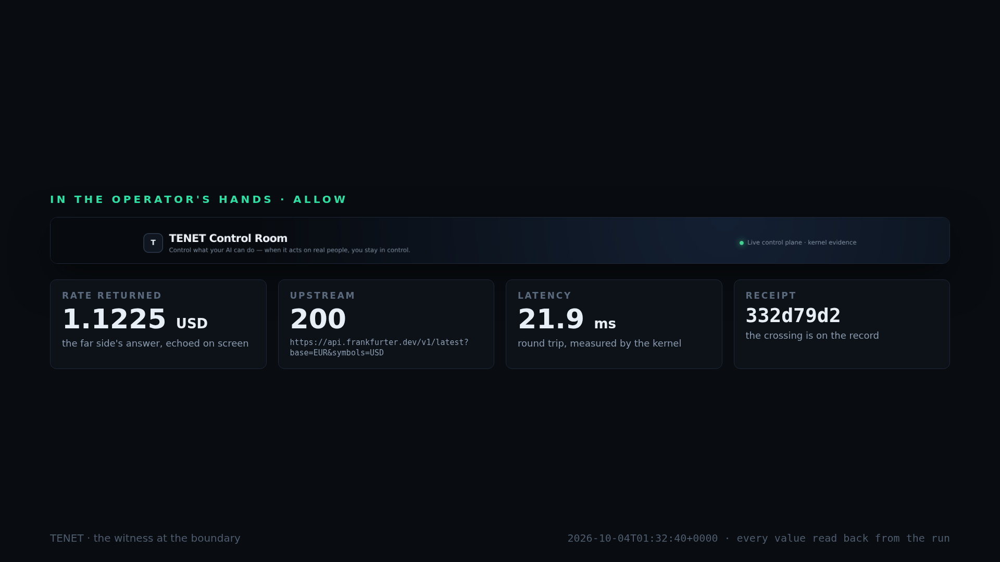

# TENET — AI Control Layer

> **The agent proposes. TENET decides. Data moves only after authorization.**

TENET is an enforcement resource for agentic systems. It sits between an AI agent and the tools/data the agent can affect, evaluates identity, entitlement, delegation, warrant and policy **before execution**, and records evidence of the decision and downstream result.

**Live Control Room:** https://hackyeah-2026-ai-control-layer-production.up.railway.app/

**One front door:** `/` — the Control Room. It is the only entry point this README names, and it is the
page that links onward: the console carries a plain `<a href="/onboarding">The guide →</a>`, and the
guide carries a plain `<a href="/">← The Control Room</a>` back, so the corridor between the two rooms
is walkable by a text-only fetch (`curl -s <url> | grep -c 'href="'` is at least 1 on both pages). The
`/observer` read-only room carries its own doors back to both rooms.

## Watch the story

[](docs/tenet-happy-path.mp4)

[▶ Watch the 42-second TENET happy path](docs/tenet-happy-path.mp4) — the real control room, one live run, every number read back from the kernel.

## The happy path

Watch one real request move through the boundary:

```text
User: "Read the latest EUR/USD reference rate"
        ↓
AI agent proposes: fx.read_rate
        ↓
TENET: identity → entitlement → warrant → policy
        ↓
KERNEL: ALLOW
        ↓
real upstream request
        ↓
result + receipt
```

The Control Room should make five questions obvious:

**What did the agent ask? Why was it allowed? Did data leave? What happened? Where is the proof?**

The model is reasoning evidence, **not authority**. The browser is a control surface, **not authority**.

## Who uses TENET?

**Target end user: a Goldman Sachs-style Technology Risk / AI governance operator.**

TENET is not primarily a dashboard to inspect a kernel. It is a **security resource inside the AI workflow**:

- an agent runtime submits an action to TENET before touching a protected tool or data source;
- TENET applies the firm's policy and scoped authority;
- the operator gets an understandable decision and proof;
- the business function gets the authorized result without giving the model unrestricted power.

This maps directly to the current Goldman direction: its 2026 operating model describes AI adoption alongside stronger risk management, data lineage and auditability; Goldman also says institutional AI products need auditable grounding and outputs traceable to verified sources. Goldman’s Client Security Statement describes firmwide AI governance, least-privilege access and intentionally restricted external LLM use.  
Sources:  
- https://www.goldmansachs.com/investor-relations/financials/8k/2026/8k-01-15-26.pdf
- https://www.goldmansachs.com/insights/goldman-sachs-exchanges/building-ai-systems-for-capital-markets
- https://www.goldmansachs.com/disclosures/client-security-statement.pdf
- https://developer.gs.com/docs/services/transaction-banking/best-practices-api-connect/

**This is a target enterprise use case, not a claim that Goldman Sachs has deployed TENET.**

## Why now?

Agentic AI is moving from experiments into business workflows. Goldman Research says enterprise adoption is shifting toward implementation, while its own operating-model work highlights risk management, process automation, data lineage and auditability.

The security gap is specific:

> A human may be entitled to a resource while a particular agent should not be.

TENET makes that distinction enforceable at the action boundary.

## Security model

```text
User / system
     ↓
Agent proposal
     ↓
TENET Control Plane
     ↓
Enforcement Kernel
     ├─ identity
     ├─ entitlement
     ├─ on-behalf-of / delegation
     ├─ warrant
     └─ policy
     ↓
ALLOW / DENY / REDACT / HUMAN
     ↓
Upstream
     ↓
Receipt + evidence
```

**No entitlement, no data.**  
**No authority, no action.**  
**Denied means no upstream execution through the enforced path.**  
**Unknown stays unknown.**

The evidence chain remains distinct:

`run_id → model_trace_id → proposal_id → action_id → decision_id → upstream_call_id → receipt_id`

An `upstream_call_id` is never relabelled from an `action_id`.

## Why MCP is not enough

MCP provides a standardized transport and authorization framework, but its own specification says implementers must build robust consent and authorization flows and treat tool behavior with caution.

TENET adds the product-level enforcement boundary:

`Agent → proposed action → TENET decision → gated execution → proof`

This is consistent with current agent-authorization work: Google's AP2 explicitly describes tighter constraints for agents than ordinary human authorization and separates delegation from action authorization.

Sources:
- https://github.com/modelcontextprotocol/modelcontextprotocol
- https://github.com/modelcontextprotocol/modelcontextprotocol/blob/main/docs/specification/2026-07-28/index.mdx
- https://github.com/google-agentic-commerce/AP2/blob/main/docs/ap2/agent_authorization.md

## Happy path

The [42-second proof video](docs/tenet-happy-path.mp4) shows one resource and two agents. Every number, hash, receipt and verdict below was read back from the running kernel during the recorded run - none of it is scripted prose.

```text
USER REQUEST
  "Read the latest EUR/USD reference rate"
        │
        ▼
AI AGENT WANTS DATA
  fx-trader  →  fx.read_rate
        │
        ▼
TENET DECIDES BEFORE ANYTHING MOVES
  who is acting?  what may this agent access?
        │
        ├─────────────── ALLOW ───────────────┐
        │  value EUR/USD 1.1225               │  same resource
        │  upstream HTTP 200, 19.2 ms         │  same request
        │  sha256 f63f64a5…                   │
        │  receipt 332d79d2                   │
        ▼                                     ▼
  the far side answered            support-copilot → fx.read_rate
  (a real crossing, HTTP 200)
                                             │
                                             ▼
                                     DENY — no entitlement to
                                     market_data.fx.read
                                     upstream contacted: NO
                                     (calls stay 4, boundary attempts 0)
                                     receipt a0010008
```

Selected timeline (the compact frames in the video):

| t | What the video shows | Where it comes from |
|---|---|---|
| 0–6 s | the insight: your monitoring says the agent works; nothing you own can stop it | the problem the product answers |
| 6–12 s | an agent with production credentials acts before anyone is watching | the premise of the boundary |
| 12–18.5 s | TENET stands at the boundary and asks one question before execution | the kernel's single decision point |
| 18.5–26 s | **ALLOW**: the real value arrives (1.1225, HTTP 200, 19.2 ms, sha256, receipt `332d79d2`) | live Frankfurter response, recorded in `docs/tenet-happy-path-evidence.json` |
| 32–37.5 s | **HOLD → a named human approves**; only then does the call cross (+1 upstream call, HTTP 200) | operator decision + execution record |
| 26–32 s | **DENY**: *Frankfurter was NOT contacted* (calls stay 4, boundary attempts 0), receipt `a0010008` | kernel denial + the far side's own call journal |
| 37.5–42 s | **"No warrant, no action."** + this run's receipts, rate and commit | the recorded run |

The property the video is built around:

> **The same question, asked by two agents, ends two different ways - and the denied call never reaches the data source.**

The headline card follows the record the operator selects, so the ALLOW can still be inspected after the DENY has happened; with nothing selected it shows the latest action.

`evidence.json` next to the video holds the raw values it was built from (`value`, `http_status`, `response_sha256`, `latency_ms`, both `receipt` ids, and the upstream call counter before/after each action).

## Architecture

**MCP = transport/protocol. TENET Enforcement Kernel = authority.**

The model may reason, plan and propose. It cannot authorize itself or bypass the kernel.

Internal `warrnt/*` names remain only where compatibility requires them. The product surface is **TENET**.

## Evidence discipline

- LLM output is never authorization.
- A receipt records evidence; it does not create authority.
- Process success is not proof of upstream contact.
- An action ID is never relabelled as an upstream call ID.
- A denial is an event and is recorded.
- Secrets never enter the browser, README, video or public evidence.
- If evidence is missing, TENET says **unknown**.

> **The UI cannot manufacture a cleaner story than the evidence supports.**

## Run everything yourself

One command runs every check this submission owes, and ends with a verdict. A SKIP is never
counted as a pass: if something cannot run here, the script says so and prints the one line that
would make it run.

```bash
pip install -r node/requirements.txt        # the mirrored node's dependencies
bash scripts/run_all_checks.sh
```

```
STATE  CHECK                                  TIME    WHY IT MATTERS
PASS   console: inline JavaScript parses      0.7s    a syntax error blanks the whole page
PASS   console: layout invariants            0.1s     grid rows, kill-switch floor, responsive fallback
PASS   console: 15 viewports                  1.9s    no overlap or clipped text at any size
FAIL   mirror: matches the pinned commit      5.0s    node/ must equal the canonical repo or judges read stale code
FAIL   node: the test suite                   8.8s    positive and negative cases per control (D10)
PASS   node: proof gates                      5.9s    console, security boundaries, live vector, demo path
------------------------------------------
passed 4   failed 2   skipped 0
VERDICT: FAIL - at least one check did not hold.
```

**Two known failures, neither of them hidden.** The script reports them rather than skipping them,
which is the point of having it:

| failure | cause | status |
|---|---|---|
| `mirror: matches the pinned commit` | six lines in `node/warrnt/proxy.py` were edited in the mirror instead of upstream, so the mirror no longer equals the commit it pins | the change needs a pull request in the canonical repository, then a pin bump here |
| `node: the test suite` | two tests assert POSIX file modes and `chmod` is a no-op on Windows, so they are red on a Windows checkout and green on CI's Linux | the fix travels with the node's own open pull request |

Everything else passes, including the console across all fifteen viewports.

Useful variants:

| | |
|---|---|
| `SKIP_NETWORK=1` | skip the checks that clone the canonical node repo |
| `SKIP_NODE=1` | skip the mirrored node's tests and gates (fast, console only) |
| `PYTHON=/path/to/python` | use a specific interpreter (a virtualenv, say) |

Two further scripts back the documents:

```bash
python3 scripts/benchmark_scale.py          # the tables in docs/complexity-and-scale.md
python3 scripts/doc_qa.py                   # every claim in the documents, turned into a check
```

`scripts/console_layout_sweep.py` drives the console through fifteen viewports from 400×600 to
3840×2160 and reads the verdict the page computes about itself; it exits `2` (SKIP) when no browser
is installed, because an unchecked sweep must never look like a sweep that passed.

## Demo

The canonical demo is intentionally one story:

**REQUEST → AGENT → TENET CHECK → ALLOW/DENY → REAL DATA / NO DATA → PROOF**

The final submission video should show the real happy path in ~60 seconds, without terminals, Railway logs, private chats, credentials or development noise.

## Repository

```text
control_plane/   API seam and kernel-backed projections
control_room/    orchestration and provider evidence
node/            pinned internal implementation mirror
index.html       TENET Control Room
tests/           security and contract tests
docs/            architecture and evidence contracts
```

## API surface

`GET /api/security-events?limit=20` — live security-decision feed.

`GET /api/security-events/{run_id}` — causal evidence graph.

`GET /api/model-usage` — read-only DeepSeek resource evidence.

`GET /api/overview` · `/api/state` · `/api/activity` · `/api/actions` · `/api/agents` · `/api/warrants`.

`POST /api/actions/{action_id}/approve` · `/deny`.

`POST /api/agents/{agent_id}/revoke`.

`POST /mcp` — intercepted `tools/call` path.

## Implemented

- pre-execution MCP interception;
- signed/scoped warrants with TTL;
- actor-specific restrictions and entitlement checks;
- explicit on-behalf-of delegation;
- parameter-aware policy decisions;
- allow / deny / redact / human / revoked vocabulary;
- contextual revoke;
- append-only/hash-chained receipt evidence;
- upstream access-log evidence;
- explicit DeepSeek provider integration;
- provider trace/resource journal;
- security-event projection and causal evidence graph;
- operator Control Room with live model-resource display;
- the Control Room classified-data-row honesty rule: a crossing is shown only when the record
  carries an upstream `http_status`, and an intercept has no destination to show;
- the AC3/AC4 data-flow proof pair — `scripts/data_flow_demo.py` raises the real upstream and
  control plane and drives one ALLOW (`fx-trader`) and one DENY (`support-copilot`), reading the
  upstream's own `sent` counter on both sides of each call. Executed result: allow `sent` +1 with
  a real `https://api.frankfurter.dev/v1/latest?...` crossing (`value 1.1225`), deny `sent` +0 with
  `upstream.contacted: false`.
- the Control Room's end-user journey, a real first-step entry point: an **intent box**
  ("What should your AI do?") posts the real proposal path `POST /api/ask` and renders the model's
  answer as a **proposal that is never a permission** (the kernel's own verdict, when present, is
  shown as the action card; when it is absent, no decision is invented). A separate, visible
  **"Who should act?"** selector drives the real `POST /api/demo/run` for the same resource
  (`fx.read_rate`) so `fx-trader` → ALLOW, `support-copilot` → DENY and `fx-auditor` → HOLD are the
  three real verdicts, not three mock-ups. A HOLD shows the real **human control** — "The request
  has NOT been sent yet." with Approve / Deny that POST the real `/api/actions/{id}/approve|deny`
  route behind the operator token and then **re-read** the action to show the state the kernel
  actually reached; with no token the control says plainly that it is protected instead of
  pretending to work. The page never fabricates a receipt, an action id or a crossing.
  Executed proof against the shipped kernel (a loopback stand-in for the Frankfurter tool server
  behind `WARRNT_UPSTREAM`, so the live-upstream warrants `W-9001`/`W-9003` are issued): `fx-trader`
  → **ALLOW**, `executed=True`; `support-copilot` → **DENY**, `executed=False`, no upstream contact;
  `fx-auditor` → **HUMAN**, `executed=False`, no upstream contact, entering `pending` as a real
  action id; then `resolve_hold(approve=True)` → the re-read record shows `state: approved`,
  `decision: human`, and a real receipt. The Act-7 tests are
  `tests/test_act7_intent_and_control.py` (T1–T6 plus the defect case, positive and negative, read
  from the rendered DOM and from the bytes the page actually sent); all eight fail on the page as it
  stood before this change and pass after it.

### The journey — the browser's own demo (no credential)

`POST /api/scenario/journey` runs four real requests through the kernel in order and returns the
four verdicts with their own records: `allow` (`fin-reconcile` reading payments), `redact`
(`support-copilot` reading CRM with PII fields — stripped before the reader saw them), `deny`
(`support-copilot` attempting a 9000-row export — `executed=False`, `upstream_contacted=False`),
`hold` (`report-bot` attempting a 500-row export — `decision: human`, waiting for a person).
Measured against the shipped kernel (2026-10-04, live upstream):

```
allow  fin-reconcile    allow    exec=True  upstream=True
redact support-copilot  redact   exec=True  upstream=True
deny   support-copilot  deny     exec=False upstream=False
hold   report-bot       human    exec=False upstream=False
```

Tool and args are constants in the server, never read from the request; the payload carries what
the kernel decided and the boundary's own counters, so a beat that stops holding up shows up
instead of being smoothed over. Full contract record: `docs/act-5-live-security-trace-contract.md`
(Amendment 1); tests: `tests/test_journey_scenario.py`.

## Deliberately not claimed

A diagram is not presented as a deployed feature. If evidence is unavailable, TENET shows unknown or incomplete. A future enterprise connector is not presented as installed until it exists and is exercised.

The Control Room's live render is proven by a real headless render (`chromium --dump-dom`, the same
mechanism as `scripts/check_rendered_trace.py`), and by `tests/test_control_room_experience.py`
(AC3: JSON-object values never render as `[object Object]`; the action card is the first block,
before any technical identifier; the empty state explains TENET and offers a way to start; a `429`
with `retry_after_s` renders `Rate limited · retrying in Ns` with the real N). Where chromium is
absent the test **skips** with a reason — it never claims a render it did not perform.


## Demo sentence

> **Watch the agent ask for data. TENET stops it before the request reaches the data source — then shows you the evidence.**

## Run locally

The front door is `/`, so run the control plane — the same command the platform runs — and walk from it:

```bash
uvicorn control_plane.app:app --host 127.0.0.1 --port 8099
# open http://127.0.0.1:8099/            the Control Room (the front door)
#      http://127.0.0.1:8099/onboarding  the guide the console links to
#      http://127.0.0.1:8099/observer    the read-only room
```

A bare static server (`python -m http.server 8099`) serves the console file only: `/onboarding` is a
control-plane route, and GitHub Pages is the static host that resolves it (Pages maps `/onboarding` to
`onboarding.html`). The link itself is plain markup on both hosts either way.

Tests: `python -m pytest tests/ -q`

The paired data-flow proof (raises the real upstream + control plane, prints raw JSON, exits
non-zero unless the pair is a genuine allow-crossing / deny-non-contact):

```bash
python scripts/data_flow_demo.py
```

Console gates: `python scripts/check_console.py` (both inline script blocks parse) and
`python scripts/console_layout_check.py index.html` (layout invariants).

DeepSeek is configured in the deployment environment with `DEEPSEEK_API_KEY`. Never commit or print the secret.

**Project:** https://github.com/indrad3v4/hackyeah-2026-ai-control-layer  
**Enforcement dependency:** https://github.com/indrad3v4/warrnt


## Principles

1. The agent proposes; the kernel decides.
2. User entitlement does not automatically grant agent authority.
3. TENET decides before the upstream call.
4. Human approval is explicit where required.
5. Every decision should leave inspectable evidence.
6. Privacy and least privilege are part of the product, not an afterthought.
